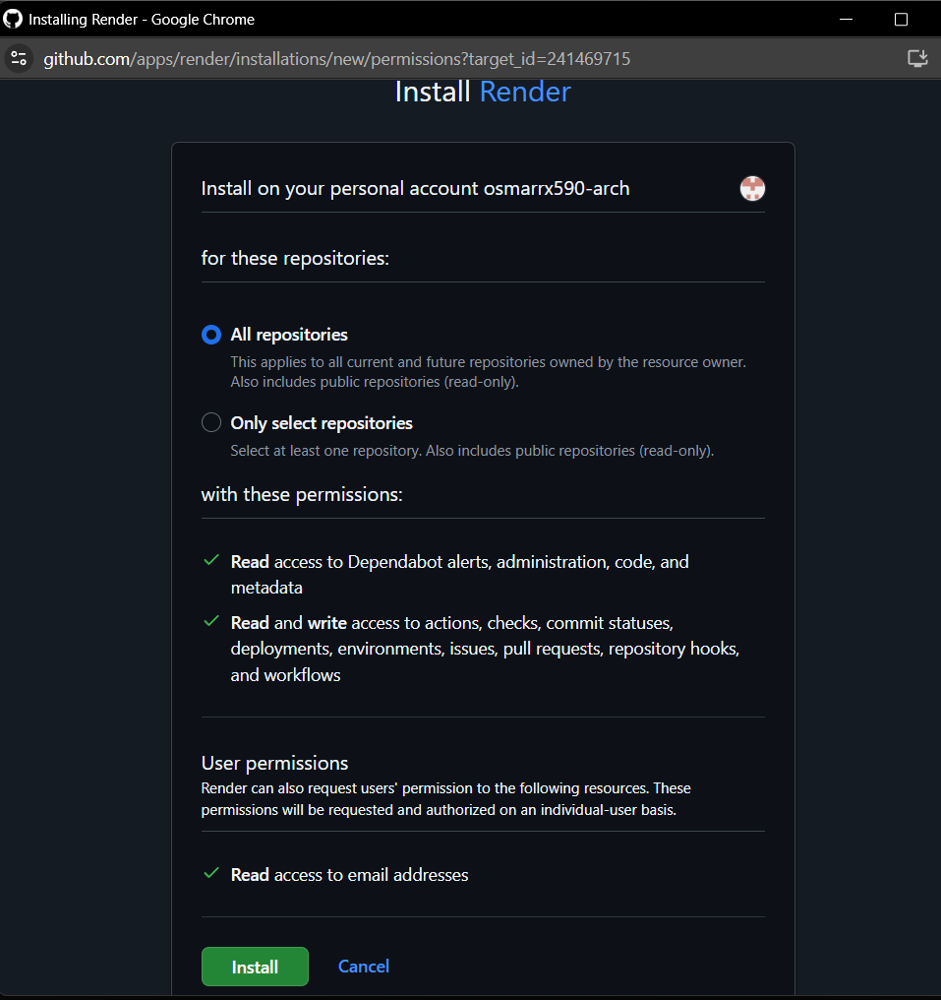

O Render é uma das melhores plataformas para hospedar aplicações Full Stack (Frontend e Backend) no mesmo plano gratuito.

No entanto, por ter um Frontend (Vite/React) e um Backend (Python), você terá que configurar dois serviços separados no Render, que interagem entre si.

Roteiro de Publicação no Render
Aqui está o plano de ação, focando na configuração de cada parte do seu projeto:

1. Preparação do Backend (API)
Seu Backend Python (backend/) precisará de um arquivo principal chamado requirements.txt para que o Render saiba quais bibliotecas instalar.

Ajuste: Certifique-se de que o seu requirements.txt está completo e liste todas as dependências (FastAPI, Uvicorn, SQLAlchemy, etc.).

Servidor: O Render usará o Uvicorn (ou Gunicorn) para rodar o seu main.py.

2. Preparação do Frontend (Vite/React)
O Render precisa saber como compilar (build) seu código React/Vite:

Ajuste: Certifique-se de que o package.json tem o comando de build correto (ex: "build": "vite build").

Saída: O Render precisa ser configurado para servir a pasta de saída do build (provavelmente dist/).

3. Ações no Render
Você precisará de uma conta no Render e, idealmente, conectar seu repositório Git (GitHub, GitLab ou Bitbucket) ao Render.

A. Deploy do Backend (API Python)
Crie um "Web Service": No painel do Render, escolha New Web Service.

Conecte o Repositório: Conecte o repositório onde está seu código.

Configurações:

Environment: Python

Build Command: Comando para instalar dependências (geralmente vazio se você tem requirements.txt).

Start Command: Comando para iniciar o servidor (Ex: uvicorn backend.main:app --host 0.0.0.0 --port $PORT).

Após o Deploy: O Render lhe dará uma URL de API pública (Ex: https://sua-choperia-api.onrender.com).

B. Deploy do Frontend (Vite/React)
Crie um "Static Site": No painel do Render, escolha New Static Site.

Conecte o Repositório: Conecte o mesmo repositório.

Configurações:

Build Command: O comando para compilar o Frontend (Ex: npm install && npm run build).

Publish Directory: A pasta que contém os arquivos finais do site (Ex: dist).

Após o Deploy: O Render lhe dará uma URL do Frontend (Ex: https://sua-choperia-web.onrender.com).

4. Conexão entre Frontend e Backend (O Passo Mais Crítico)
Agora você precisa dizer ao seu Frontend (o código React/Vite) qual é o URL da API que acabou de ser implantada:

No seu código Frontend (dentro da pasta src/), onde você faz as requisições (Ex: usando fetch ou axios), você precisa mudar a URL base.

Mude: De http://localhost:8000/

Para: https://sua-choperia-api.onrender.com/ (a URL que o Render deu para seu serviço de backend).

Para começar, a maneira mais fácil de usar o Render é conectá-lo a um repositório Git. Você gostaria de usar o GitHub ou prefere fazer o upload dos arquivos manualmente?

Você está no passo de conectar o Render à sua conta do GitHub (osmarrx590-arch). Este é o caminho correto para automatizar o deploy do seu projeto Full Stack!

🎯 Próximo Passo: Instalação e Conexão
O que você está vendo na tela é a solicitação de permissões que o Render precisa para acessar e publicar seus projetos.

Revisão das Opções:

"Install on your personal account osmarrx590-arch": Isso garante que o Render terá acesso aos seus repositórios pessoais.

"For these repositories":

"All repositories" (Recomendado): Esta é a opção mais fácil. Ela permite que o Render veja todos os seus projetos (atuais e futuros), tornando o deploy mais rápido.

"Only select repositories": Você teria que selecionar manualmente o repositório do seu projeto Full Stack.

"With these permissions": O Render está pedindo permissão de leitura/escrita para realizar a instalação, compilação e publicação do seu código. Isso é necessário para que ele automatize o processo de deploy.

Ação a Tomar:

Confirme se a opção "All repositories" está selecionada (ou selecione o repositório específico do seu projeto).

Clique no botão verde "Install" na parte inferior da tela.

Depois de Clicar em "Install"
Você será redirecionado de volta ao painel do Render, onde poderá começar a criar os dois serviços de que seu projeto precisa:

O "Web Service" para o seu Backend Python.

O "Static Site" para o seu Frontend Vite/React (após o build).

Clique em "Install" e me avise quando estiver no painel do Render para que possamos começar a configurar o seu primeiro serviço, que será a API Python.

Ótimo! Agora que o Render está conectado ao seu GitHub, podemos começar a hospedar as duas partes do seu projeto.

Vamos começar pelo Backend (a API em Python), pois o Frontend precisará da URL desta API para funcionar.

Passo 1: Configurar o Backend (Web Service Python)
No painel do Render, clique em "New +" (Novo) no canto superior direito e selecione "Web Service".

Conexão do Repositório: O Render pedirá para você selecionar o repositório. Escolha o repositório onde está o seu projeto Full Stack.

Nome do Serviço:

Name: Dê um nome, por exemplo, choperia-api-backend.

Configurações do Serviço:

Environment: Mude para Python 3.

Region: Escolha a região mais próxima de você ou do seu público-alvo (Ex: Oregon (US West) ou outra disponível).

Branch: Mantenha como main (ou a branch principal do seu código).

Root Directory: Como seu código Python está dentro da pasta backend/, digite backend aqui. Isso é crucial!

Build Command: Deixe vazio. O Render usará o requirements.txt automaticamente.

Start Command: Este comando inicia seu servidor Python. Assumindo que você usa FastAPI e o arquivo principal é main.py, insira:

Bash

uvicorn main:app --host 0.0.0.0 --port $PORT
(Note que removemos o prefixo backend. porque já definimos o Root Directory como backend.)

Instância:

Plan: Selecione o plano Free (Grátis).

Clique no botão azul "Create Web Service".

O Render começará o processo de deploy. Ele vai instalar suas dependências e tentar iniciar o servidor.

Acompanhe os logs. O deploy pode levar alguns minutos. Quando terminar, você terá a URL pública da sua API.

Me avise quando o deploy do seu Web Service estiver concluído e compartilhe a URL que o Render forneceu (ex: https://...onrender.com). Precisaremos dessa URL para o próximo passo!